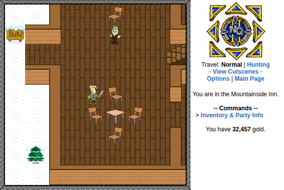

# Neoquest II Auto - A Neoquest II Autoplayer

## Disclaimer

This is an automated game player and very obviously not permitted by site rules. Use at your own
risk, as I will not be held liable if you get iced! Use sensibly, and take breaks between usages.

By the way, this is very much a work in progress, and it is quite fragile since it relies on pretty
specific HTML element patterns in some cases. I would say 85% of the time, it
works 100% of the time. Sometimes the Neopets site may hiccup and submit actions more than once,
causing desync
between the program and your game. That's the nature of using UI automation libraries I guess. Make
sure the site is stable and try to **play during off-peak
hours** with a **stable internet connection** for best results. If your connection drops, good luck
finding your way back to the next starting point.

Lastly, I used and modified the movement scripts and guide provided by user Norava from neocodex.us,
so thanks to them and the community.

## What This Program Is

Neoquest II Auto is exactly what it sounds like: an autoplayer for the PHTML game Neoquest II on
neopets.com. It is meant to help you grab all the game trophies and minimize the time you have to
spend clicking away. What would normally take you weeks should now ideally take you hours with
minimal user interaction.

You can also just use it for grinding if you don't trust the navigation or want to play manually.

## Requirements

- Python >= 3.10

## Features

- Beginning-to-end game completion methods sorted by act
- Automated skillpoint spending based on well-tested builds
    - Some manual supervision may be required
- Mouse-free map navigation - custom or predefined routes
- Fully automated in-game battle completion
    - Automatic potion usage based on efficiency

## Setup Instructions

First, clone the repo into a location of your choice:

```
git clone https://github.com/wngo1337/neoquestII-auto.git
```

Next, create a virtual environment, activate it, and install the requirements from requirements.txt:

```
python3 -m venv .venv
source .venv/bin/activate

# Use the line below if you are using Windows CMD, or the one below it if you are using Powershell
# .venv\Scripts\activate.bat
# .venv\Scripts\Activate.ps1

pip install -r requirements.txt
```

You also have to install the browser binary (Chromium) after you install Playwright:

```
playwright install
```

Now for the hardest part, you have to copy your Chromium browser's adblock extension into the
RequiredData/AdblockDir folder in side this project. This allows the browser instance to run quicker
by not loading ads. The assumption is that everyone is on Ublock Origin Lite, which has folder name
ddkjiahejlhfcafbddmgiahcphecmpfh. You will copy the folder **inside** this folder that contains the
actual extension info.

If there is a better way to block ads, I would really love to know. However, I do not know one
right now.

On Linux/Mac, the folder should be located at: ~/\<
YourUsername/.config/google-chrome/Default/Extensions/ddkjiahejlhfcafbddmgiahcphecmpfh


I'm not actually sure where this container folder is located on Windows. My guess is: C:
\\Users\<YourUsername>\\AppData\\Local\\Google\\Chrome\\User
Data\\Default\\Extensions\\ddkjiahejlhfcafbddmgiahcphecmpfh

Inside this folder, you will find a folder with a name of something like 2025.911.1335_0. Copy this
folder itself into neoquestII-auto/RequiredData/AdblockDir

Lastly, you will just need to enter in the correct login information in the user_info.txt file
located in RequiredData/TextFiles.

For Neopass login, you will need to provide your Neopass email, Neopass password, and account
username like this:


For traditional login, you just need to provide your account username and password like this:


## Using the Program

At this point, the program should be ready to run. If you are using Neopass, there is an extra flag
that you should provide like this:

```
python3 -m src.autoplayer_launcher --use-neopass
```

Otherwise, omit the flag if you want to use traditional login. You should be taken through the login
process and land on the overworld map.

An important point: **any** option that you select should be made when on an overworld page. That is
the assumed starting point for all functionality of this autoplayer.

|                         |
|:----------------------------------------------------------------------:|
| An example of where you would want to start running autoplayer methods |

In your terminal, you will see a simple menu like this:


Each act comes with its own set of completion methods, with the next one starting from where the
previous one finishes. Ideally, you run them all in order and never have to interact with the game
**besides equipping weapons and armour from bosses after each script finishes running**. Given that
drops are RNG, it's easier if you just do it manually.

## Troubleshooting

**My program desynced and isn't following the correct path anymore!**

I know, that sucks. Kill the program with Ctrl-C, walk back to the starting point of the method you
were running, and run the method again.

**Rohane died and I respawned and the autoplayer is continuing to travel!**

It's actually pretty common at level 1 if you get unlucky, and only at level 1. Again, kill the
program rather than respawning first, and go back to the proper starting point before running the
method again.

## Starting Locations For Each Completion Method

This section is mainly for knowing where to walk back to if your program gets desynced.

### Act 1 Sections

#### Initial Training Grind


#### Defeat Miner Foreman


#### Defeat Zombom


#### Defeat Sand Grundo

I forgot to take a screen shotshot of this one. It is right beside where you find Mipsy.

#### Defeat Ramtor - First Encounter


#### Defeat Ramtor - Second Encounter


### Act 2 Sections

#### Defeat Leximp


I kind of had to edit this one because I forgot to screenshot it.

#### Caves of Terror + Talinia


#### Kolvars + Grind



#### Lost Caves Grind + Scuzzy


### Act 3 Sections

#### Grind + Defeat Siliclast


Locations below this still need to be added later.

#### Grind + Defeat Gebarn II


#### Get Velm + Defeat Revenant + Gemstone Stuff


#### Defeat Coltzan + Do Gemstone Stuff


#### Go To Pyramid and Fight Anubits


### Act 4 Sections

#### Defeat Meuka


#### Defeat Spider Grundo


#### Complete Four Faeries Sequence + Boss Fight


#### Defeat Hubrid Nox


#### Defeat Esophagor


### Act 5 Sections

#### Defeat Fallen Angel


#### Defeat Devilpuss


#### Complete Faerie Thief Questline and All Running Around


#### Complete Act 5 Finale -> Does NOT Include King Terask II Fight


